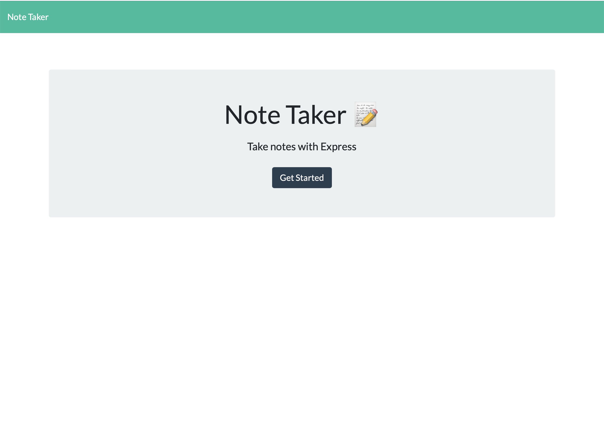
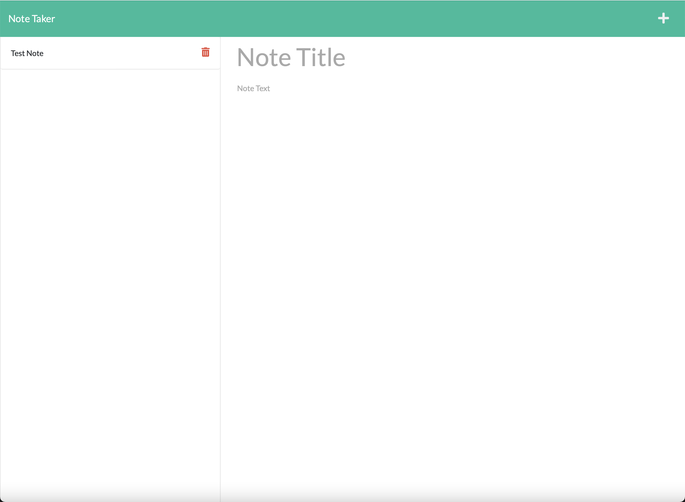
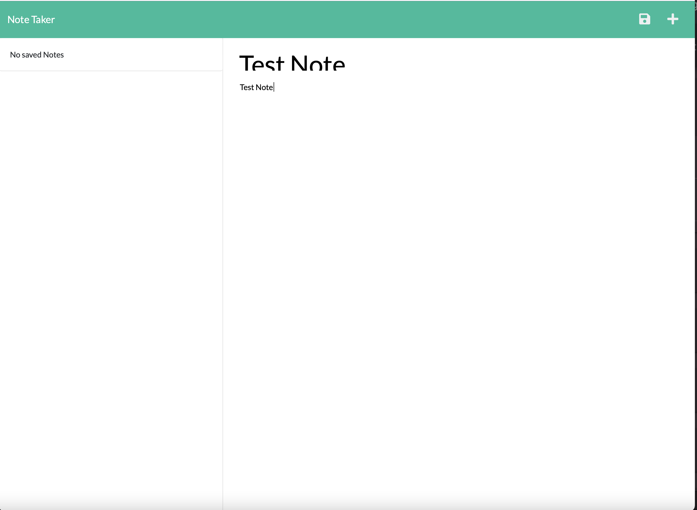
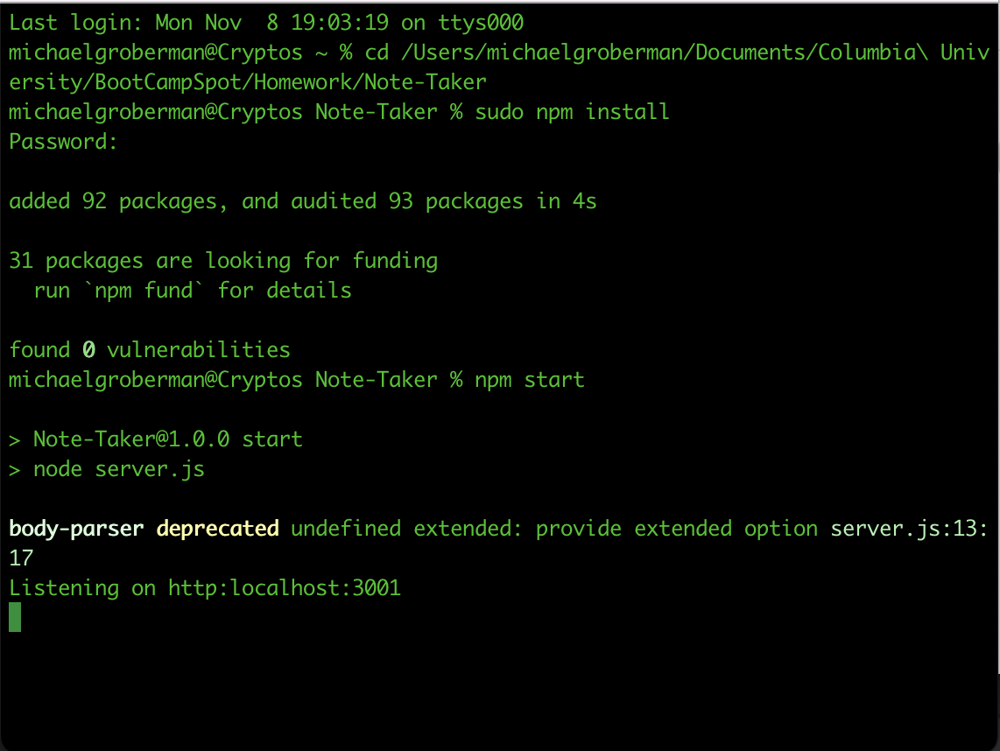
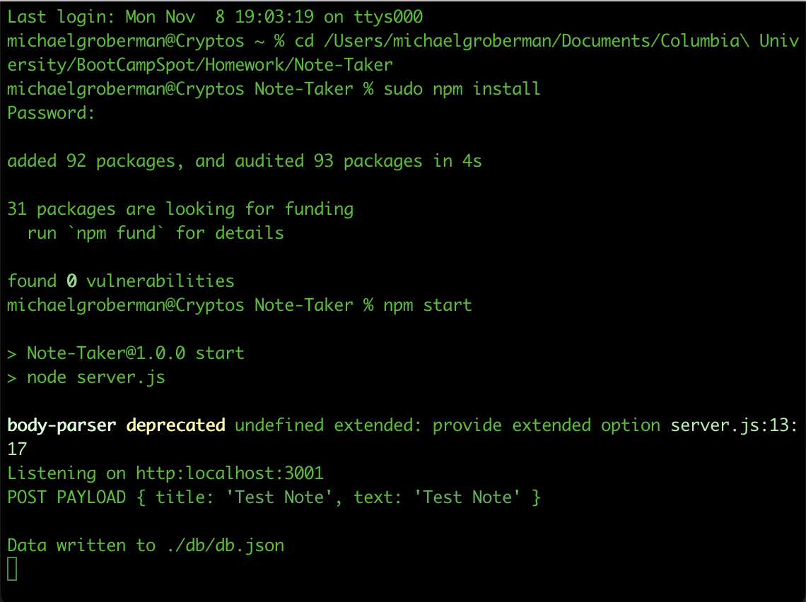

# Note-Taker

A simple Web Application that can be used to read, write, and delete notes from a database.
This app uses a simple JSON document for its database storage.
We're using Express to define all of the API method request routes. The application was also deployed to heroku.

## Contents

1. [Installation](#installation)
2. [Usage](#usage)
3. [Deployed](#deployed)

## Installation

1. Download or clone repository
2. Node.js is required to run the application
3. `npm install` to install the required npm packages

## Usage

- Application will be invoked by using the following command:

  `npm start`

- Application will be served and hosted locally at http:localhost:3001

## Deployed

(https://damp-bayou-41457.herokuapp.com/)

